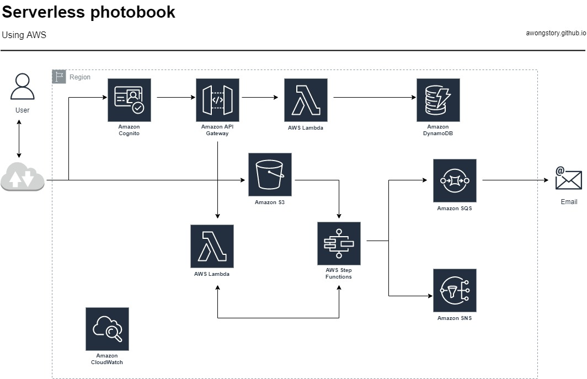

Lab tutorial here: https://amazon.qwiklabs.com/

NOTE : You'll need to search for "Building Serverless Applications with an Event-Driven Architecture on the catalog tab.

NOTE: Looking over the lab, I realized that there were a few things that were already provisioned. However, I  wanted to do things independently, so while I followed along their overall project breakdown, I took some liberties in my own implementation. You can pay for their labs (I find the monthly subscription more reasonable at $29 since it's unlimited credits for the month but don't want to commit for the year). 

In this project, I am building a web-based book printing app using a set of serverless technologies. My goals are to learn, and thus demonstrate:

1. Event-driven architecture
2. How Step Functions is configured to orchestrate serverless applications
3. How to take advantage of Amazon SQS and SNS
4. Create and configure Lambda functions and API Gateway resources
5. Made configuration updates to restore API functionality

The diagram of what I'm trying to accomplish looks like this:
 


## Key services used in this project:
1. Amazon API Gateway 
2. AWS Lambda - to run code, serverless. 
3. AWS Step Functions - allows coordination of multiple AWS services into serverless workflows, allowing you to build and update apps quickly.
4. Amazon S3 - object storage service
5. Amazon Simple Queue Service/SQS
6. Amazon Simple Notification Service/SNS
7. Amazon Rekognition
8. Amazon Cognito

## APIs used in this project:
1. **/presigned** - user sends request for presigned URLs to upload their images to an S3 bucket.
2. **/CreateBookBinding** - user triggers book creation process by indicating that they have finished uploading their images. This triggers the image-processing state machine.
3. **/execution** - the user approves the PDF by acknowledging an email from Amazon SNS

## Step Functions and state machines:
1. **ImageProcessStateMachine** : the job of this state machine is to pick up user-uploaded images from the S3 /Incoming folder, process the images, and create a PDF album for book printing. Key steps in this flow includes: image validation, resizing, watermarking. 
2. **BookprintStateMachine** : this state machine reads messages from the print vendor Amazon SQS and sends the photo book to a third-party vendor for printing. 

Let's get started!

### Generating pre-signed URLs: ###
[Sauce](https://catalog.us-east-1.prod.workshops.aws/v2/workshops/17f04680-db43-4fb6-85e9-c1f0b696c6c1/en-US/intro)
All objects on S3 buckets by default are private, with only the object owner having permission to access these objects. However, you can apply appropriate bucket/IAM policies to allow users to access these objects (for example, making objects public if you're using the S3 bucket to host a static website). Alternatively, you can also use presigned URLs where users can interact with objects without needing AWS credentials or IAM permissions. Presigned URLs are only valid for the specified duration. 

There are different ways to execute this, including using boto or serverless. 

1. Create S3 bucket

We need to create our S3 bucket. I named mine `photobook-upload`. In configuring your bucket, turn OFF block all public access, and hit the checkmark where you acknowledge that this setting might result in the bucket becoming public. Hit Create bucket. 

When your bucket is created, go to Permissions > Cross-origin resource sharing (CORS). CORS defines a way for client applications from one domain to interact with resources on another domain. The new console only accepts JSON now. The CORS configuration is 

```
[
    {
        "AllowedHeaders": [
            "Authorization"
        ],
        "AllowedMethods": [
            "PUT",
            "GET"
        ],
        "AllowedOrigins": [
            "*"
        ],
        "ExposeHeaders": [],
        "MaxAgeSeconds": 3000
    }
]
```

Save your changes. 

2. Create Lambda function.
The Lambda function will generate the presigned URL to upload the object. 
- Go to Amazon Lambda > Function > Create function.
- Select **Author from scratch**, and specify function name (e.g., PresignedUrlFunction).
- Select Node.js 12.x as the Runtime. 

- Expand Choose or create an execution role > Create new role with basic Lambda permissions.
  This will create a role in IAM with basic lambda execution permissions (you'll edit this later). 
- Click Create Function. 

- Once function is created, go to Code, and replace function's code with:

```
var AWS = require('aws-sdk');
var s3 = new AWS.S3({
  signatureVersion: 'v4',
});


exports.handler = (event, context, callback) => {
  const randomID = Number(Math.random() * 10000000);
  const url = s3.getSignedUrl('putObject', {
    Bucket: 'photobook-uploads',
    Key: 'incoming/' + `${randomID}.jpg`,
    Expires: 600,
  });

  callback(null, url);
};
```

- Replace **`BUCKET NAME`** with your bucket name. 
- Go to Configuration > Permissions > Execution role > Role name. 

  - IAM role should open in new browser tab. Create an inline policy under Add permissions. 

  - You can do this either by using the visual editor or the JSON editor. Either way, replace the policy with the following and replace **`BUCKET NAME`** with your S3 bucket name.

```
{
    "Version": "2012-10-17",
    "Statement": [
        {
            "Effect": "Allow",
            "Action": "s3\:PutObject",
            "Resource": "arn\:aws\:s3:::BUCKET NAME/*"
        }
    ]
}
```
- Click Review, then Name your policy (eg., PresignedUrlBucketAccess_policy), and Create policy.


### Part 2: Creating an API on API Gateway. ###

We already have our Lambda function. Next, I created a REST API using the API Gateway console, then invoke my API. When we invoke our API, the API Gateway routes the request to the Lambda function, runs it, and returns the response to API Gateway which returns the response to us. 

1. Go to API Gateway and under REST API > Build. 
2. Choose Protocol > REST; Create New API > New API; and under Settings, name your API and leave Endpoint Type as Regional... then Create API.
3. In the second pane, under Resources > select POST and confirm by clicking the check mark. 
4. For Lambda function, enter `PresignedUrlFunction`; when you type anything into the bar, the bar populates available Lambda Functions. Click OK when the alert window asks if you want to Add Permission to Lambda function. 
5. Under your new Method, click the Actions drop down list and Create Resource.
6. Under resource name, enter Resource Name: presigned and Resource Path: /presigned. 

Hit Next, review the route that API Gateway creates for you, then choose Next. Review the stage that API Gateway creates for you, then choose Next and Create. 

To test your API:
1. Choose your API.
2. Note your API's invoke URL. 
3. Copy your API's invoke URL to a web browser address. Append your Lambda function name (in this case, `PresignedUrlFunction`) to your invoke URL to call your Lambda function. 

The full URL should have the following structure: `https://APIURL.execute-api.REGION.amazonaws.com/PresignedUrlFunction`

Your browser sends a `GET` request to the API. 

4. Verify your API's response. You should see a presigned URL. 

#### Throttling requests to your HTTP API ####
I opted to configure throttling and quotas for my API to protect them from being overwhelmed with too many requests. While you can do it with AWS CLI, you can also do this via the left-side menu under Stages > Default Method Throttling. 
